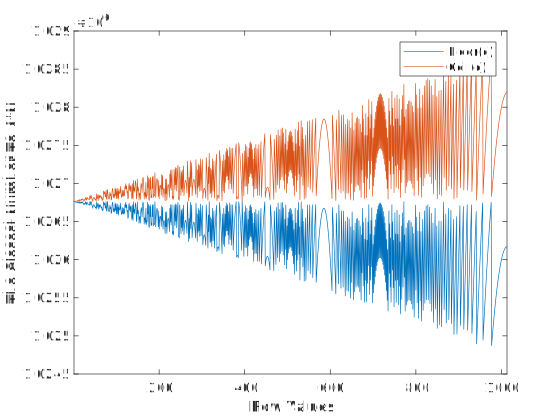
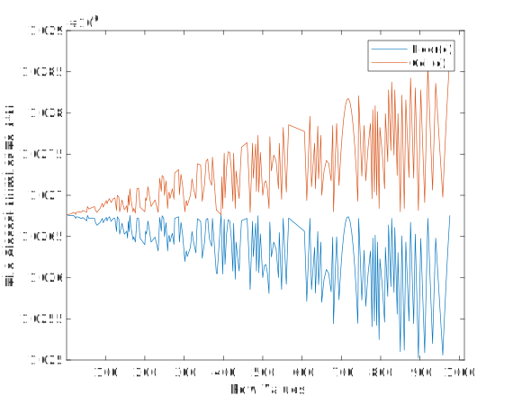
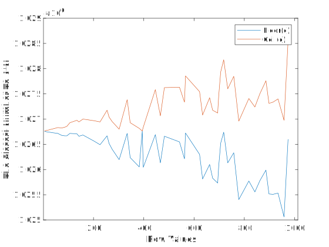
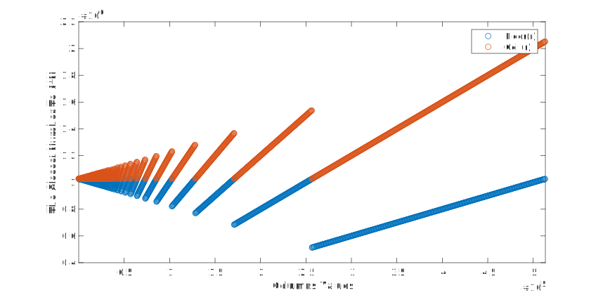

# Fermat-RSA
Code For Fermat Factorization Research


## The closest value to 4 * 1303 * 197 at each row 



```matlab
p = 1303; q =  197;
fourN = 4 * p * q;
list_Floor = zeros(1, floor(sqrt(fourN)));
list_Ceil = zeros(1, floor(sqrt(fourN)));
for r=1:floor(sqrt(fourN))
    c_Floor = floor((fourN - r^2) / (2 * r) + 1); 
    c_Ceil = ceil((fourN - r^2) / (2 * r) + 1);
    list_Floor(r) =  (r^2 + 2 * r *(c_Floor - 1));
    list_Ceil(r) = (r^2 + 2 * r *(c_Ceil - 1));
end
plot(1:floor(sqrt(fourN)), list_Floor, 1:floor(sqrt(fourN)), list_Ceil);
xlabel("Row Values"); xlim([1, floor(sqrt(fourN))])
ylabel("The Closest Number To 4*N");
legend("Floor(c)", "Ceil(c)");
```


## The closest value to 4 * 1303 * 197 after eliminating the odd rows and the even columns



```matlab
p = 1303; q = 197;
fourN = 4 * p * q;

listR = [];
listValFloor = [];
listValCeil = [];
for r=1:floor(sqrt(fourN))
    c_Floor = floor((fourN - r^2) / (2 * r) + 1);
    c_Ceil = ceil((fourN - r^2) / (2 * r) + 1);
    if mod(r, 2) == 1 || mod(c_Floor, 2) == 0
        continue;
    end
    listR = [listR, r];
    listValFloor = [listValFloor,  (r^2 + 2*r*(c_Floor - 1))];
    listValCeil = [listValCeil,  (r^2 + 2*r*(c_Ceil - 1))];
end

plot(listR, listValFloor, listR, listValCeil);
xlabel("Row Values"); xlim([1, floor(sqrt(fourN))]);
ylabel("The Closest Number To 4*N");
legend("Floor(c)", "Ceil(c)");
```


## The closest value to 4 * 1303 * 197  after eliminating the odd rows and the even columns. Also, the row which is not equal to 2 times a prime number is removed



```matlab
p = 1303; q = 197;
fourN = 4 * p * q;

listR = [];
listValFloor = [];
listValCeil = [];
primeList = primes(floor(sqrt(fourN)));
for r=1:floor(sqrt(fourN))
    c_Floor = floor((fourN - r^2) / (2 * r) + 1);
    c_Ceil = ceil((fourN - r^2) / (2 * r) + 1);
    if mod(r, 2) == 1 || mod(c_Floor, 2) == 0
        continue;
    end
    if ismember(r / 2, primeList) == 0
        continue;
    end
    listR = [listR, r];
    listValFloor = [listValFloor,  (r^2 + 2*r*(c_Floor - 1))];
    listValCeil = [listValCeil,  (r^2 + 2*r*(c_Ceil - 1))];
end

plot(listR, listValFloor, listR, listValCeil);
xlabel("Row Values"); xlim([1, floor(sqrt(fourN))]);
ylabel("The Closest Number To 4*N");
legend("Floor(c)", "Ceil(c)");
```


## The closest value to 4 * 1303 * 197 by column prespective



```matlab
p = 1303; q =  197;
fourN = 4 * p * q;
list_Floor = zeros(1, floor((fourN - 1) / 2 + 1));
list_Ceil = zeros(1, floor((fourN - 1) / 2 + 1));
for c=1:floor((fourN - 1) / 2 + 1)
    r_Floor = floor(sqrt( (c-1)^2 + fourN ) - c + 1); 
    r_Ceil = ceil(sqrt( (c-1)^2 + fourN ) - c + 1);
    list_Floor(c) =  (r_Floor^2 + 2 * r_Floor *(c - 1));
    list_Ceil(c) = (r_Ceil ^2 + 2 * r_Ceil *(c - 1));
end
plot(1:floor((fourN - 1) / 2 + 1), list_Floor, 'o', ...
    1:floor((fourN - 1) / 2 + 1), list_Ceil, 'o');
xlabel("Columns Values"); xlim([1, floor((fourN - 1) / 2 + 1)])
ylabel("The Closest Number To 4*N");
legend("Floor(r)", "Ceil(r)");
```


## The closest value to 4 * 1303 * 197 by column prespective after eliminating the odd rows and the even columns 


```matlab
p = 1303; q =  197;
fourN = 4 * p * q;
listC = [];
listValFloor = [];
listValCeil = [];
for c=1:floor((fourN - 1) / 2 + 1)
    r_Floor = floor(sqrt( (c-1)^2 + fourN ) - c + 1); 
    r_Ceil = ceil(sqrt( (c-1)^2 + fourN ) - c + 1);
    if mod(r_Floor, 2) == 1 || mod(c, 2) == 0
        continue;
    end
    listC = [listC, c];
    listValFloor = [listValFloor, (r_Floor^2 + 2 * r_Floor *(c - 1))];
    listValCeil = [listValCeil, (r_Ceil ^2 + 2 * r_Ceil *(c - 1))];
end
plot(listC, listValFloor, 'o', ...
    listC, listValCeil, 'o');
xlabel("Columns Values"); xlim([1, floor((fourN - 1) / 2 + 1)])
ylabel("The Closest Number To 4*N");
legend("Floor(r)", "Ceil(r)");
```


## Factoring in O(1)
```java
BigInteger ONE = BigInteger.valueOf(1);
BigInteger FOUR = BigInteger.valueOf(4);
String N = "734465642310298504833940186303906456";
N = N + "22848602022499768136179936493297372335479";
BigInteger n = new BigInteger(N);
BigInteger fourN = n.multiply(FOUR);
BigInteger ceilSqrt = fourN.sqrt().add(ONE);

// By The Quadratic Formula
BigInteger qBySol = ceilSqrt.subtract(ceilSqrt.pow(2).subtract(fourN).sqrt());
qBySol = qBySol.divide(TWO);
System.out.println("The Smallest Prime Factor Is: " + qBySol);
```


## Buy me a Coffee: 
BTC: bc1q2kqvggm552h0csyr0awa2zepdapxdqnacw0z5w


